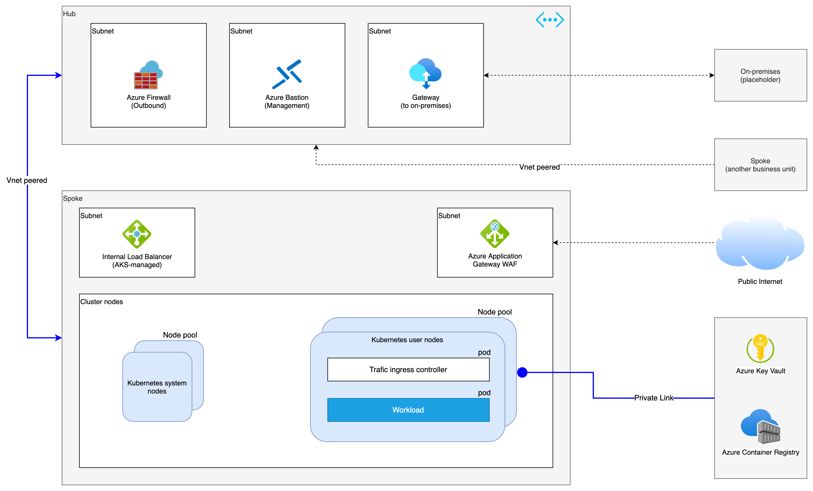

# Architecture

In this reference architecture, we’ll build a baseline infrastructure that deploys an Azure Kubernetes Service (AKS) cluster. This article includes recommendations for networking, security, identity, management, and monitoring of the cluster based on an organization’s business requirements.

Hub
The hub virtual network is the central point of connectivity and observability. Within the network, three subnets are deployed.

Subnet to host Azure Firewall
Azure Firewall is firewall as a service. The firewall instance secures outbound network traffic. Without this layer of security, the flow might communicate with a malicious third-party service that could exfiltrate sensitive company data.

Subnet to host a gateway
This subnet is a placeholder for a VPN or ExpressRoute gateway. The gateway provides connectivity between the routers in the on-premises network and the virtual network.

Subnet to host Azure Bastion
This subnet is a placeholder for Azure Bastion. You can use Bastion to securely access Azure resources without exposing the resources to the internet. This subnet is used for management and operations only.

Spoke
The spoke virtual network will contain the AKS cluster and other related resources. The spoke has three subnets:

Subnet to host Azure Application Gateway
Azure Application Gateway is a web traffic load balancer operating at Layer 7. The reference implementation uses the Application Gateway v2 SKU that enables Web Application Firewall (WAF). WAF secures incoming traffic from common web traffic attacks. The instance has a public frontend IP configuration that receives user requests. By design, Application Gateway requires a dedicated subnet.

Subnet to host the ingress resources
To route and distribute traffic, Traefik is the ingress controller that is going to fulfill the Kubernetes ingress resources. The Azure internal load balancers exist in this subnet.

Subnet to host the cluster nodes
AKS maintains two separate groups of nodes (or node pools). The system node pool hosts pods that run core cluster services. The user node pool runs the Contoso workload and the ingress controller to facilitate inbound communication to the workload. The workload is a simple ASP.NET application.

For additional information, Hub-spoke network topology in Azure.