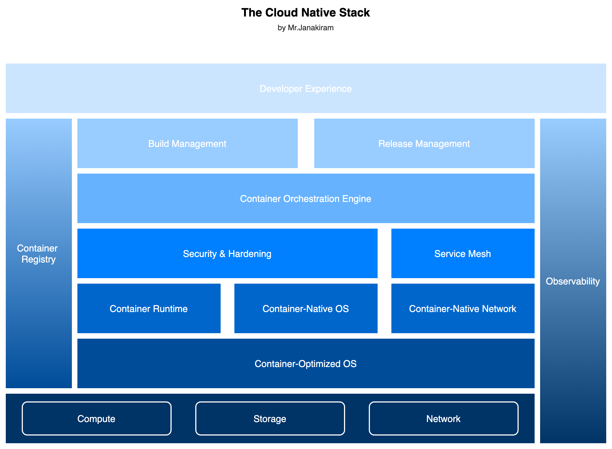

# The Kubernetes Way

How Kubernetes addresses the various pressing challenges in the infrastructure as a whole?

Let us see how Kubernetes and the various tools takes up this difficult job abstracting a lot of the complex details required during onboarding and maintenance of infrastructure.

## Compute
Every application requires some degree of computing power depending on the business logic and the demand and the infrastructure should allow for incrementally scale up or down compute as needed depending on the ever changing requirements.

Kubernetes allows for managing compute efficiently and scale it up/down as needed.
The compute available for the application depends on various factors. The type of node in which you run the containers (the number of CPU cores available to the node, the processors attached, the RAM available and other accessories like GPUs in some cases which are compute intensive), the constraints you have set manually including the cpu, memory limits, pod affinity/anti-affinity and so on.
And the best part about it is that all this compute is shared within the cluster or a specific namespace thereby allowing you to effectively manage the resources you have. And if you are not sure about the change in the computing needs, all you need to do is setup an autoscaler (HPA, VPA, CA) and that will scale your compute up/down depending on the constraints you set.

>* Horizontal Pod Autoscaler (HPA): Automatically scales the number of Pods in a replication controller, deployment, replica set or stateful set based on observed CPU utilization. It does not apply to objects that can't be scaled, for example, DaemonSets. The resource determines the behavior of the controller. The controller periodically adjusts the number of replicas in a replication controller or deployment to match the observed metrics such as average CPU utilisation, average memory utilisation or any other custom metric to the target specified by the user.
>* Vertical Pod Autoscaler (VPA): Frees the users from necessity of setting up-to-date resource limits and requests for the containers in their pods. When configured, it will set the requests automatically based on usage and thus allow proper scheduling onto nodes so that appropriate resource amount is available for each pod. It will also maintain ratios between limits and requests that were specified in initial containers configuration.
>* Cluster Autoscaler (CA): Is a tool that automatically adjusts the size of the Kubernetes cluster when
>    1. There are pods that failed to run in the cluster due to insufficient resources.
>    2. There are nodes in the cluster that have been underutilized for an extended period of time and their pods can be placed on other existing nodes.

Now, what if you want to do serverless? Its easy when especially when you work with the Kubernetes ecosystem that you have projects like KNative, OpenFaas, etc. doing exactly this (Ultimately, serverless is nothing but abstracting everything for the developers and offering the elasticity in compute as needed)

Or if you are someone holding a legacy infrastructure and cannot afford to run all your compute on containers, you can go for projects like Kubevirt which allows for exactly that running containers and virtual machines side by side in your cluster.

Having all these choices makes Kubernetes a great choice for managing compute at any scale.

## Storage
Managing state is difficult for a reason. Managing your storage improperly may lead to bottlenecks in your application as you scale. Every disk is limited by its IOPS (Input/Output Operations Per Second) and as you scale, the storage layer might cause quite a few problems and may often become the bottleneck.

This might require clustering your storage possibly with multiple replicas and to add to this, you would also need to maintain periodic backups and handle seamless failovers. Now, while Kubernetes does have its way of managing storage using Persistent Volumes, Claims and Storage Classes it does not handle every problem with respect to storage and rather leaves it to the storage provider.
Its has been possible to [plug in many storage provisioners to Kubernetes](https://kubernetes.io/docs/concepts/storage/storage-classes/#provisioner) and add [many volume plugins](https://kubernetes.io/docs/concepts/storage/volumes/) but the future aligns itself towards [CSI](https://kubernetes.io/blog/2019/01/15/container-storage-interface-ga/) and is therefore promising for compatibility with any storage provider of your choosing.

For eg. if you would like to bring in file systems like Ceph onto Kubernetes, you do have a Ceph-CSI driver or if you would like to reduce friction while maintaining Ceph, you can even go for something like Rook with Ceph CSI. There are many players in this space and you can read about how they perform and differ here each providing different set of options including File, Block, NFS and more.
If you would like to get more idea on the various storage options available.

