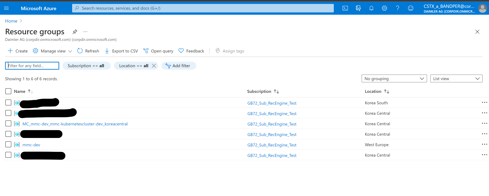
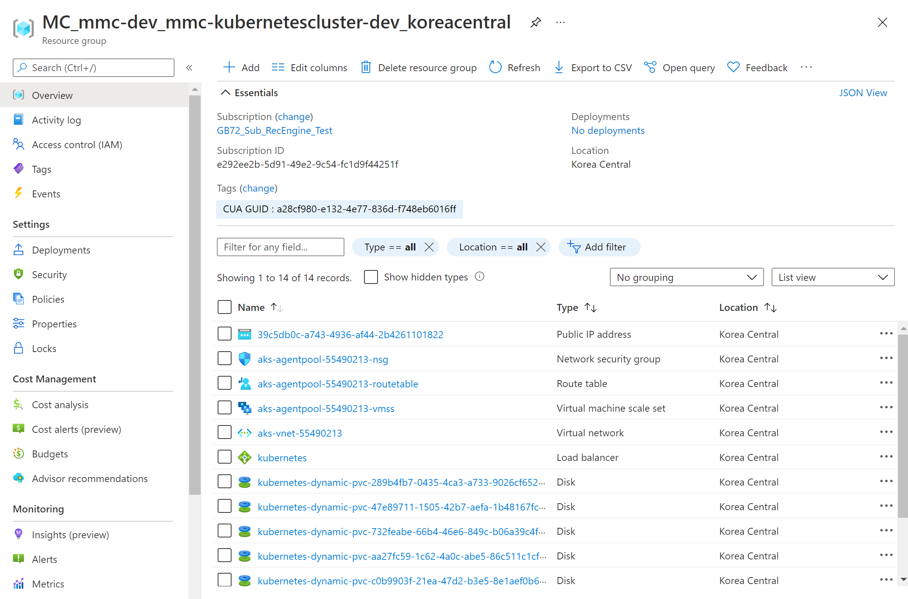
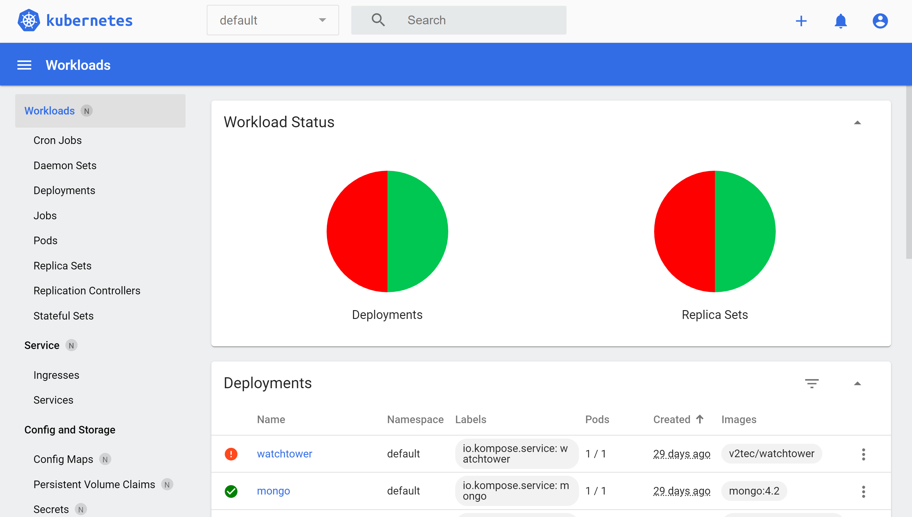

# Harness Environment deployment to AKS cluster via kubectl
The Azure kubernetes Service and it's resource group already has been deployed in `GB72_Sub_RecEngine_Test` so we'll use the existing K8 cluster for harness deployment. But in case of deployment from scratch follow these steps:

## Create the cluster

To have a clean overview of what is being provisioned under the hood, we create a new resource
group and and create our Kubernetes cluster within it:

```shell
az group create --name project-dev --location koreacentral
az aks create --resource-group project-dev --name project-kubernetescluster-dev --enable-managed-identity --generate-ssh-keys --kubernetes-version 1.19.7
```

Let's inspect the created resources:



The `az aks create` command created a second resource group named
`MC_project-dev_project-kubernetescluster-dev_koreacentral` containing all resources provisioned for our AKS
cluster:


The resource group we explicitly created only holds the AKS resource _per se_:



All other resource for the cluster are created in its own resource group.

>TIP
📝 This resource group and all its resources will be deleted when the cluster is destroyed.

## Get the existing cluster

```shell
az aks show --resource-group project-dev --name project-kubernetescluster-dev
```
Output:
```json
{
  "aadProfile": null,
  "addonProfiles": {
    "azurepolicy": {
      "config": null,
      "enabled": false
    },
    "httpApplicationRouting": {
      "config": null,
      "enabled": false
    },
    "omsAgent": {
      "config": {
        "logAnalyticsWorkspaceResourceID": "/subscriptions/e292ee2b-5d91-49e2-9c54-fc1d9f44251f/resourceGroups/DefaultResourceGroup-SE/providers/Microsoft.OperationalInsights/workspaces/DefaultWorkspace-e292ee2b-5d91-49e2-9c54-fc1d9f44251f-SE"
      },
      "enabled": true
    }
  },
  "agentPoolProfiles": [
    {
      "availabilityZones": null,
      "count": 3,
      "enableAutoScaling": null,
      "enableNodePublicIp": null,
      "maxCount": null,
      "maxPods": 110,
      "minCount": null,
      "name": "agentpool",
      "nodeTaints": null,
      "orchestratorVersion": "1.19.9",
      "osDiskSizeGb": 128,
      "osType": "Linux",
      "provisioningState": "Succeeded",
      "scaleSetEvictionPolicy": null,
      "scaleSetPriority": null,
      "type": "VirtualMachineScaleSets",
      "vmSize": "Standard_DS2_v2"
    }
  ],
  "apiServerAccessProfile": {
    "authorizedIpRanges": null,
    "enablePrivateCluster": false
  },
  "dnsPrefix": "project-kubernetescluster-dev-dns",
  "enablePodSecurityPolicy": null,
  "enableRbac": true,
  "fqdn": "project-kubernetescluster-dev-dns-f8bff25b.hcp.koreacentral.azmk8s.io",
  "id": "/subscriptions/e292ee2b-5d91-49e2-9c54-fc1d9f44251f/resourcegroups/project-dev/providers/Microsoft.ContainerService/managedClusters/project-kubernetescluster-dev",
  "identity": {
    "principalId": "a2a70a39-9c01-40ba-b626-1e1ba7d17fa1",
    "tenantId": "9652d7c2-1ccf-4940-8151-4a92bd474ed0",
    "type": "SystemAssigned"
  },
  "kubernetesVersion": "1.19.9",
  "linuxProfile": null,
  "location": "koreacentral",
  "maxAgentPools": 100,
  "name": "project-kubernetescluster-dev",
  "networkProfile": {
    "dnsServiceIp": "10.0.0.10",
    "dockerBridgeCidr": "172.17.0.1/16",
    "loadBalancerProfile": {
      "effectiveOutboundIps": [
        {
          "id": "/subscriptions/e292ee2b-5d91-49e2-9c54-fc1d9f44251f/resourceGroups/MC_project-dev_project-kubernetescluster-dev_koreacentral/providers/Microsoft.Network/publicIPAddresses/39c5db0c-a743-4936-af44-2b4261101822",
          "resourceGroup": "MC_project-dev_project-kubernetescluster-dev_koreacentral"
        }
      ],
      "managedOutboundIps": {
        "count": 1
      },
      "outboundIpPrefixes": null,
      "outboundIps": null
    },
    "loadBalancerSku": "Standard",
    "networkPlugin": "kubenet",
    "networkPolicy": null,
    "podCidr": "10.244.0.0/16",
    "serviceCidr": "10.0.0.0/16"
  },
  "nodeResourceGroup": "MC_project-dev_project-kubernetescluster-dev_koreacentral",
  "provisioningState": "Succeeded",
  "resourceGroup": "project-dev",
  "servicePrincipalProfile": {
    "clientId": "msi"
  },
  "tags": {
    "CUA GUID": "a28cf980-e132-4e77-836d-f748eb6016ff"
  },
  "type": "Microsoft.ContainerService/ManagedClusters",
  "windowsProfile": null
}

```


## Establish Access to the Cluster

Now it's time to access our cluster. To authenticate us against the cluster Kubernetes uses _client
certificates_ and _access tokens_.

To obtain these access credentials for our newly created cluster we
use the `az aks get-credentials` command:
```shell
$ az aks get-credentials --resource-group project-dev --name project-kubernetescluster-dev
Merged "project-kubernetescluster-dev" as current context in C:\Users\r.bandpey\.kube\config

$ kubectl version # check client and server version of kubernetes
Client Version: version.Info{Major:"1", Minor:"20", GitVersion:"v1.20.2", GitCommit:"faecb196815e248d3ecfb03c680a4507229c2a56", GireeState:"clean", BuildDate:"2021-01-13T13:28:09Z", GoVersion:"go1.15.5", Compiler:"gc", Platform:"windows/amd64"}
Server Version: version.Info{Major:"1", Minor:"19", GitVersion:"v1.19.9", GitCommit:"c1ad2bc44e0c7f19a9db0879f7182ff556a8e5b4", GireeState:"clean", BuildDate:"2021-05-19T22:27:45Z", GoVersion:"go1.15.8", Compiler:"gc", Platform:"linux/amd64"}
```

`kubectl version` prints both the version of the locally running command line tool as well as the
Kubernetes version running on our cluster.

>TIP
📝 To inspect the access credentials and cluster
configuration stored for us in our `~/.kube/config` file run `kubectl config view`.

We've setup access to our Kubernetes cluster. Now we can start exploring and working with our
cluster.

## Access the Dashboard

AKS no longer comes with the kubernetes-dashboard installed by default. To get access to the dashboard run the following:
cluster:

```shell
kubectl apply -f https://raw.githubusercontent.com/kubernetes/dashboard/v2.2.0/aio/deploy/recommended.yaml

# Out
namespace/kubernetes-dashboard created
serviceaccount/kubernetes-dashboard created
service/kubernetes-dashboard created
secret/kubernetes-dashboard-certs created
secret/kubernetes-dashboard-csrf created
secret/kubernetes-dashboard-key-holder created
configmap/kubernetes-dashboard-settings created
role.rbac.authorization.k8s.io/kubernetes-dashboard created
clusterrole.rbac.authorization.k8s.io/kubernetes-dashboard created
rolebinding.rbac.authorization.k8s.io/kubernetes-dashboard created
clusterrolebinding.rbac.authorization.k8s.io/kubernetes-dashboard created
deployment.apps/kubernetes-dashboard created
service/dashboard-metrics-scraper created
deployment.apps/dashboard-metrics-scraper created
```


Now, accessing the dashboard requires us to create a `ServiceAccount` with the
_cluster-admin_ `ClusterRole`.

To create these `Resources` within our Kubernetes cluster we will first declare the desired
configuration for our `ServiceAccount` in a YAML file and apply the desired configuration to our
cluster using the `kubectl apply` command:


```shell
$ kubectl apply -f infrastructure/harness-environment/aks-kubectl-deployment/yaml_files/dashboard-admin.yaml
serviceaccount/admin-user created
clusterrolebinding.rbac.authorization.k8s.io/admin-user created
```

We need to discover the created users secret access token, to gain access to the dashboard:

```shell
$ kubectl -n kubernetes-dashboard get secret
NAME                               TYPE                                  DATA   AGE
admin-user-token-nj6l4             kubernetes.io/service-account-token   3      7m11s
default-token-2jz89                kubernetes.io/service-account-token   3      11m
kubernetes-dashboard-certs         Opaque                                0      10m
kubernetes-dashboard-csrf          Opaque                                1      10m
kubernetes-dashboard-key-holder    Opaque                                2      10m
kubernetes-dashboard-token-hqvtx   kubernetes.io/service-account-token   3      11m
```

Find the secret that belongs to the `admin-user-token` and use `kubectl describe` to see the content of the secret:

```shell
$ kubectl -n kubernetes-dashboard describe secret admin-user-token-nj6l4
Name:         admin-user-token-22554
Namespace:    kubernetes-dashboard
Labels:       <none>
Annotations:  kubernetes.io/service-account.name: admin-user
              kubernetes.io/service-account.uid: 02a8e2e7-c25d-48a2-b8b8-f6ce99e77a5d

Type:  kubernetes.io/service-account-token

Data
====
ca.crt:     1765 bytes
namespace:  20 bytes
token:      XXXXXXXXXXXXXXXXXXXXXXXXXXXXXXXXXXXXXXXXXXXXXXXXXXXXXXXXXXXXXXXXXXXXXXXXXXXXXXXXXXXXXXXXXX
```

>WARNING:
⚠️ Watch out! You token will have a different random 5 character suffix.
:::

Copy the token to your clipboard for the next step.

Now we start the kubernetes proxy to access the remote API safely on our local machine:

```shell
$ kubectl proxy
Starting to serve on 127.0.0.1:8001
```

The process keeps running until you interrupt it using `Ctrl-C`. Let's keep it running for now.

[Access the dashboard](http://localhost:8001/api/v1/namespaces/kubernetes-dashboard/services/https:kubernetes-dashboard:/proxy/)
and login using the token you've acquired for the _admin-user_ `ServiceAccount`.

Take your time to explore the dashboard. Make use of the `Namespace` selector to navigate the
different namespaces.



>WARNING:
⚠️ **Security Note:** The dashboard component is considered a "security risk", because it is an additional way to access your cluster - and you have to take care of securing it.

Normally, you would not install the dashboard component in production clusters. There is an option for disabling the dashboard, even after installation: `az aks disable-addons -a kube-dashboard -n my_cluster_name -g my_cluster_resource_group`.
:::

## Get the existing cluster status


```shell

kubectl get pods,services,deployments,jobs,daemonset
```
## Cluster cleanup
```shell
kubectl delete deployments --all
kubectl delete services --all
kubectl delete pods --all
kubectl delete daemonset --all
```


## Azure Container Registry Deployment
In order to be able to store the custom Docker images we need a _container registry_. 
```shell
$ az acr create --name projectacrdev --resource-group project-dev --sku basic --admin-enabled

# now let's attach the container registry to the cluster

$ az aks update --resource-group project-dev --name project-kubernetescluster-dev --attach-acr projectacrdev
```

## Build a Custom Image

First, let's build the recommender API Docker image
Clone the codebase:
```shell
git clone https://com.visualstudio.com/DefaultCollection/Mercedes%20me%20Care/_git/MCS%20Recommendation%20Platform
```
**Modify Docker compose file**: Open docker-compose.yaml in a text editor. The file configures the `mscrpadmin` and `mscrpopenapi` services.

```yml
version: '3.4'

services:
  mscrpadmin:
    image: mscrpadmin
    build:
      context: .
      dockerfile: ./Dockerfile.admin
    ports: 
      - "5002:5002"
  mscrpopenapi:
    image: mscrpopenapi
    build:
      context: .
      dockerfile: ./Dockerfile.openapi
    ports: 
        - "5001:5001"
```
Update the image property in the both services. Prefix the image name with the login server name of your Azure container registry, `projectacrdev.azurecr.io`

It should look like the following:
```yml
version: '3.4'

services:
  mscrpadmin:
    image: projectacrdev.azurecr.io/mscrpadmin
    build:
      context: .
      dockerfile: ./Dockerfile.admin
    ports: 
      - "5002:5002"
  mscrpopenapi:
    image: projectacrdev.azurecr.io/mscrpopenapi
    build:
      context: .
      dockerfile: ./Dockerfile.openapi
    ports: 
        - "5001:5001"

```
Run compose locally
```shell
docker-compose up --build -d
```
To be able to interact with our registry, we first need to login.

```shell
ACRPWD=$(az acr credential show -n projectacrdev --query "passwords[0].value" -o tsv)
docker login projectacrdev.azurecr.io -u projectacrdev -p $ACRPWD
```

Might be nessacary
```
kubectl create secret docker-registry acrsecrets --docker-server=projectacrdev.azurecr.io --docker-username=projectacrdev --docker-password=$ACRPWD
```

```
az acr build --image adminapi:v1 --registry projectacrdev --file Dockerfile.admin .
az acr build --image openapi:v1 --registry projectacrdev --file Dockerfile.openapi .
```


>TIP:
📝 In this sample, we used the `admin` account of our registry to login - basically with username/password.
>In secure/production environments, you should not enable the `admin` account on the registry and login via Azure Active Directory: `az acr login -n <ACR_NAME>`. The token that is issued will be valid for _3 hours_.


### Delete pods with matching name

kubectl get pods --show-labels

kubectl get pods -l app.kubernetes.io/instance=hbase-1623423839
kubectl delete endpoints -l app.kubernetes.io/instance=hbase-1623423839

list release name
helm list

helm uninstall hbase-1623423839

now let's upgrade habse with new tag

kubectl get pods -l app=project.recommenderapi.backend -w


now let's assign this label and upgrade helm

got to \infrastructure\hbase-apiv1\hbase>


helm upgrade hbase .

doesnt pick up changes

helm uninstall hbase .
helm install hbase .


### Load Balancer

a service of type LoadBalancer is the one, that enables us to expose a service via an Azure Loadbalancer with a public IP adress.

```shell
kubectl apply -f api-service-loadbalancer.yaml
kubectl get services -w
```


As you can see, after a short amount of time, the loadbalancer-contactsapi is receiving an external IP adress from the Azure Loadbalancer.

Our API should now be accessible - in this case - via http://20.194.50.25:8080. If you open that link in a browser, you should see the swagger UI.