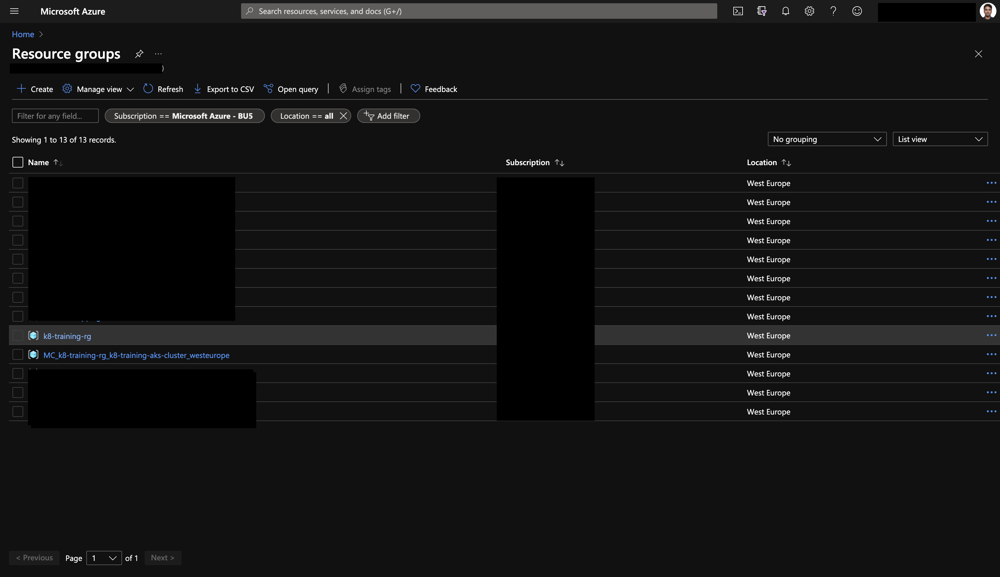
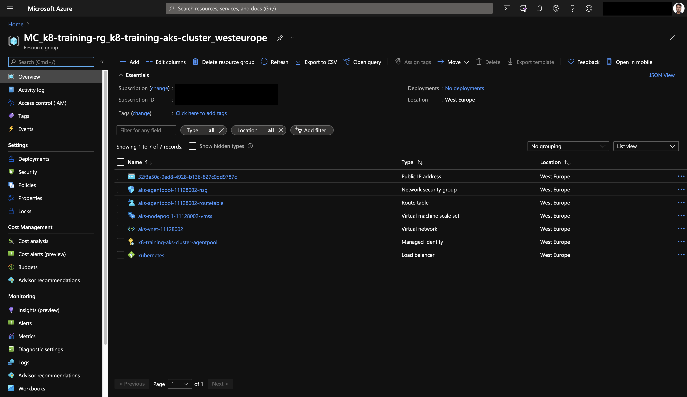

# Requirements

## Azure CLI

We will be using the Azure command line interface to create and interact with resources running in Azure. To install it, go to <https://docs.microsoft.com/en-us/cli/azure/install-azure-cli?view=azure-cli-latest> and choose your platform.

When finished, login to your Azure account from the command line:

```shell
$ az login
You have logged in. Now let us find all the subscriptions to which you have access...
```

A browser window will open, login to Azure and go back to the command prompt. Your active subscription will be shown as JSON, e.g.:

```json
{
  "cloudName": "AzureCloud",
  "id": "xxxxxxxx-xxxx-xxxx-xxxx-xxxxxxxxxxxx",
  "isDefault": false,
  "name": "Your Subscription Name",
  "state": "Enabled",
  "tenantId": "xxxxxxxx-xxxx-xxxx-xxxx-xxxxxxxxxxxx",
  "user": {
    "name": "xxx@example.com",
    "type": "user"
  }
}
```

If you have multiple subscriptions, make sure your are working with the correct one!

```shell
$ az account show
{
  "cloudName": "AzureCloud",
  "id": "xxxxxxxx-xxxx-xxxx-xxxx-xxxxxxxxxxxx",
  "isDefault": false,
  "name": "Your Subscription Name",
  "state": "Enabled",
  "tenantId": "xxxxxxxx-xxxx-xxxx-xxxx-xxxxxxxxxxxx",
  "user": {
    "name": "xxx@example.com",
    "type": "user"
  }
}
```

If that is not the correct one, follow these steps below:

```shell
$ az account list -o table
[the list of available subscriptions is printed]

$ az account set -s <SUBSCRIPTIONID_YOU_WANT_TO_USE>
```

## Install Kubectl

`kubectl` is the commandline interface for Kubernetes. You will need the tool to interact with the cluster, e.g. to create a pod, deployment or service.

If you already have the Azure CLI on your machine, you can just install it using the following command:

```shell
$ az aks install-cli
```

Or refer to the documentation for you specific platform.

[Install kubectl on Linux](https://kubernetes.io/docs/tasks/tools/install-kubectl/#install-kubectl-binary-with-curl-on-linux)

[Install kubectl on macOS](https://kubernetes.io/docs/tasks/tools/install-kubectl/#install-kubectl-on-macos)

[Install kubectl on Windows](https://kubernetes.io/docs/tasks/tools/install-kubectl/#install-on-windows-using-chocolatey-or-scoop)

## Install Helm

`Helm` is the package manager for Kubernetes. We will need it for installing several 3rd party components for our solution:

https://helm.sh/docs/intro/install/

## Terraform

`Terraform` is an open-source "infrastructure as code" software tool created by HashiCorp. It is a tool for building, changing, and versioning infrastructure safely and efficiently. We will use terraform to create several PaaS services like Azure SQL Db, CosmosDB etc. in this workshop.

https://www.terraform.io/downloads.html


# Create your first Kubernetes Cluster

In this section we will create a Kubernetes cluster using the Azure CLI, configure your local access credentials to control your cluster using kubectl, take some first steps and run our first pod.

## Create the cluster

To have a clean overview of what is being provisioned under the hood, we create a new resource
group and and create our Kubernetes cluster within.

```shell
az group create --name k8-training-rg --location westeurope
az aks create --resource-group k8-training-rg --name k8-training-aks-cluster --enable-managed-identity --generate-ssh-keys --kubernetes-version 1.19.7
```

Let's inspect the created resources:
After completion you should see following in command line:
```json
{- Finished ..
  "aadProfile": null,
  "addonProfiles": null,
  "agentPoolProfiles": [
    {
      "availabilityZones": null,
      "count": 3,
      "enableAutoScaling": null,
      "enableNodePublicIp": false,
      "maxCount": null,
      "maxPods": 110,
      "minCount": null,
      "mode": "System",
      "name": "nodepool1",
      "nodeLabels": {},
      "nodeTaints": null,
      "orchestratorVersion": "1.19.7",
      "osDiskSizeGb": 128,
      "osType": "Linux",
      "provisioningState": "Succeeded",
      "scaleSetEvictionPolicy": null,
      "scaleSetPriority": null,
      "spotMaxPrice": null,
      "tags": null,
      "type": "VirtualMachineScaleSets",
      "vmSize": "Standard_DS2_v2",
      "vnetSubnetId": null
    }
  ],
  "apiServerAccessProfile": null,
  "autoScalerProfile": null,
  "diskEncryptionSetId": null,
  "dnsPrefix": "k8-trainin-k8-training-rg-9121c7",
  "enablePodSecurityPolicy": null,
  "enableRbac": true,
  "fqdn": "k8-trainin-k8-training-rg-9121c7-5d857650.hcp.westeurope.azmk8s.io",
  "id": "/subscriptions/xxxxxxxx-xxxx-xxxx-xxxx-xxxxxxxxxxxx/resourcegroups/k8-training-rg/providers/Microsoft.ContainerService/managedClusters/k8-training-aks-cluster",
  "identity": {
    "principalId": "xxxxxxxx-xxxx-xxxx-xxxx-xxxxxxxxxxxx",
    "tenantId": "xxxxxxxx-xxxx-xxxx-xxxx-xxxxxxxxxxxx",
    "type": "SystemAssigned"
  },
  "identityProfile": {
    "kubeletidentity": {
      "clientId": "xxxxxxxx-xxxx-xxxx-xxxx-xxxxxxxxxxxx",
      "objectId": "xxxxxxxx-xxxx-xxxx-xxxx-xxxxxxxxxxxx",
      "resourceId": "/subscriptions/xxxxxxxx-xxxx-xxxx-xxxx-xxxxxxxxxxxx/resourcegroups/MC_k8-training-rg_k8-training-aks-cluster_westeurope/providers/Microsoft.ManagedIdentity/userAssignedIdentities/k8-training-aks-cluster-agentpool"
    }
  },
  "kubernetesVersion": "1.19.7",
  "linuxProfile": {
    "adminUsername": "azureuser",
    "ssh": {
      "publicKeys": [
        {
          "keyData": "ssh-rsa XXXXXXXXX...== xxx@example.com\n"
        }
      ]
    }
  },
  "location": "westeurope",
  "maxAgentPools": 100,
  "name": "k8-training-aks-cluster",
  "networkProfile": {
    "dnsServiceIp": "10.0.0.10",
    "dockerBridgeCidr": "172.17.0.1/16",
    "loadBalancerProfile": {
      "allocatedOutboundPorts": null,
      "effectiveOutboundIps": [
        {
          "id": "/subscriptions/xxxxxxxx-xxxx-xxxx-xxxx-xxxxxxxxxxxx/resourceGroups/MC_k8-training-rg_k8-training-aks-cluster_westeurope/providers/Microsoft.Network/publicIPAddresses/xxxxxxxx-xxxx-xxxx-xxxx-xxxxxxxxxxxx",
          "resourceGroup": "MC_k8-training-rg_k8-training-aks-cluster_westeurope"
        }
      ],
      "idleTimeoutInMinutes": null,
      "managedOutboundIps": {
        "count": 1
      },
      "outboundIpPrefixes": null,
      "outboundIps": null
    },
    "loadBalancerSku": "Standard",
    "networkMode": null,
    "networkPlugin": "kubenet",
    "networkPolicy": null,
    "outboundType": "loadBalancer",
    "podCidr": "10.244.0.0/16",
    "serviceCidr": "10.0.0.0/16"
  },
  "nodeResourceGroup": "MC_k8-training-rg_k8-training-aks-cluster_westeurope",
  "privateFqdn": null,
  "provisioningState": "Succeeded",
  "resourceGroup": "k8-training-rg",
  "servicePrincipalProfile": {
    "clientId": "msi",
    "secret": null
  },
  "sku": {
    "name": "Basic",
    "tier": "Free"
  },
  "tags": null,
  "type": "Microsoft.ContainerService/ManagedClusters",
  "windowsProfile": null
}
```



The `az aks create` command created a second resource group named
`MC_k8-training-rg_k8-training-aks-cluster_westeurope` containing all resources provisioned for our AKS
cluster.

The resource group we explicitly created only holds the AKS resource.



All other resource for the cluster are created in it's own resource group. This resource group and
all it's containing resources will be deleted when the cluster is destroyed.

## Establish access to the cluster

Now it's time to access our cluster. To authenticate us against the cluster Kubernetes uses client
certificates and access tokens. To obtain these access credentials for our newly created cluster we
use the `az aks get-credentials` command:

```shell
$ az aks get-credentials --resource-group k8-training-rg --name k8-training-aks-cluster
Merged "k8-training-aks-cluster" as current context in /Users/roozbehbandpey/.kube/config

$ kubectl version # check client and server version of kubernetes
Client Version: version.Info{Major:"1", Minor:"21", GitVersion:"v1.21.0", GitCommit:"cb303e613a121a29364f75cc67d3d580833a7479", GitTreeState:"clean", BuildDate:"2021-04-08T21:16:14Z", GoVersion:"go1.16.3", Compiler:"gc", Platform:"darwin/amd64"}
Server Version: version.Info{Major:"1", Minor:"19", GitVersion:"v1.19.7", GitCommit:"8ab00ff68a1763b5a506a7073cb8e67b12dfbcd7", GitTreeState:"clean", BuildDate:"2021-03-10T23:40:01Z", GoVersion:"go1.15.5", Compiler:"gc", Platform:"linux/amd64"}
WARNING: version difference between client (1.21) and server (1.19) exceeds the supported minor version skew of +/-1
```

`kubectl version` prints both the version of the locally running commandline tool as well as the
Kubernetes version running on our cluster. To inspect the access credentials and cluster
configuration stored for us in our `~/.kube/config` file run `kubectl config view`.

We've setup access to our Kubernetes cluster. Now we can start exploring and working with our
cluster.

## Access the dashboard

AKS no longer comes with the kubernetes-dashboard installed by default. Lucky
for us there is a one-liner to quickly install the dashboard into our
cluster:

```shell
kubectl apply -f https://raw.githubusercontent.com/kubernetes/dashboard/v2.2.0/aio/deploy/recommended.yaml
```

Now, accessing the dashboard requires us to create a `ServiceAccount` with the
_cluster-admin_ `ClusterRole`.

To create these `Resources` within our Kubernetes cluster we will first declare the desired
configuration for our `ServiceAccount` in a yaml file and apply the desired configuration to our
cluster using the `kubectl apply` command.

```yaml
# dashboard-admin.yaml

# Create a ServiceAccount that we can use to access the Dashboard
apiVersion: v1
kind: ServiceAccount
metadata:
  name: admin-user # Create a ServiceAccount named admin-user
  namespace: kubernetes-dashboard

# This separates multiple resource definitions in a single file
---
# Bind the cluster-admin ClusterRole to the admin-user ServiceAccount
apiVersion: rbac.authorization.k8s.io/v1
kind: ClusterRoleBinding
metadata:
  name: admin-user
roleRef:
  apiGroup: rbac.authorization.k8s.io
  kind: ClusterRole
  name: cluster-admin
subjects:
  - kind: ServiceAccount
    name: admin-user
    namespace: kubernetes-dashboard
```

Create a new `dashboard-admin.yaml` file and paste the above content.

> **INFO:** you will be creating lots of YAML files today - hooray! :) Create a folder called `yaml` in the root directory of your repo and save all files you create within that location. You can apply the manifests via kubectl from that folder.

We can apply the configuration using the following line:

```shell
$ kubectl apply -f kubernetes_service_mesh/yaml/dashboard-admin.yaml
serviceaccount/admin-user created
clusterrolebinding.rbac.authorization.k8s.io/admin-user created
```

We need to discover the created users secret access token, to gain access to the dashboard.

```shell
$ kubectl -n kubernetes-dashboard get secret
NAME                               TYPE                                  DATA   AGE
admin-user-token-bjpzl             kubernetes.io/service-account-token   3      35s
default-token-rgtx5                kubernetes.io/service-account-token   3      2m1s
kubernetes-dashboard-certs         Opaque                                0      2m1s
kubernetes-dashboard-csrf          Opaque                                1      2m1s
kubernetes-dashboard-key-holder    Opaque                                2      2m1s
kubernetes-dashboard-token-8ffp8   kubernetes.io/service-account-token   3      2m1s
```

Find the secret that belongs to the `admin-user-token` and let `kubectl describe` it to see the content of the secret:

```shell
$ kubectl -n kubernetes-dashboard describe secret admin-user-token-bjpzl
Name:         admin-user-token-bjpzl
Namespace:    kubernetes-dashboard
Labels:       <none>
Annotations:  kubernetes.io/service-account.name: admin-user
              kubernetes.io/service-account.uid: 503ea46a-152f-450a-b93b-f0ca3b98a68f

Type:  kubernetes.io/service-account-token

Data
====
namespace:  20 bytes
token:      XXXXXXXXXXXXXXXXXXXXXXXXXXXXXXXXXXXXXXXXXXXXXXXXXXXXXXXXXXXXXXXXXXXXXXXXXXXXXXXXXXXXXXXXXX
```

> Watch out! You token will have a different random 5 character suffix.

Copy the token to your clipboard for the next step.

Now we start the kubernetes proxy to access the remote api safely on our local machine:

```shell
$ kubectl proxy
Starting to serve on 127.0.0.1:8001
```

The process keeps running until you interrupt it using `Ctrl-C`. Let's keep it running for now.

[Access the dashboard](http://localhost:8001/api/v1/namespaces/kubernetes-dashboard/services/https:kubernetes-dashboard:/proxy/)
and login using the token you've acquired for the _admin-user_ `ServiceAccount`.


Take your time to explore the dashboard. Make use of the `Namespace` selector to navigate the
different namespaces.

> **Security Note:** The dashboard component is considered a "security risk", because it is an additional way to access your cluster - and you have to take care of securing it. Normally, you would not install the dashboard component in production clusters. There is an option for disabling the dashboard, even after installation: `az aks disable-addons -a kube-dashboard -n my_cluster_name -g my_cluster_resource_group`.

## Run your first pod

Now we will run our first pod on our kubernetes cluster. Let's keep the `kubectl proxy` command
running and execute this in new tab in your console.

```shell
$ kubectl run -i -t pod1 --image=busybox --restart=Never --rm=true
If you don't see a command prompt, try pressing enter.
/ #
```

We've just started a `Pod` named _pod1_ based on the _busybox_ image.

To understand the different flags we've added to the command take a look at the built in
documentation to `kubectl run`.

```shell
$ kubectl run --help
Create and run a particular image in a pod.

Examples:
  # Start a nginx pod.
  kubectl run nginx --image=nginx

...
```
# Basic Kubernetes Concepts

## Prerequisites

In order to be able to store the custom Docker images you will be creating throughout this workshop, we need a container registry. Azure provides its own service for that, the Azure Container Registry. Let's create one via the Azure CLI:

Note: Azure container registry name cannot contain special characters

```shell
$ az acr create --name k8trainingacr --resource-group k8-training-rg --sku basic --admin-enabled

# now let's attach the container registry to the cluster

$ az aks update --resource-group k8-training-rg --name k8-training-aks-cluster --attach-acr k8trainingacr
```
Output:
```json
AAD role propagation done[###################################{- Finished ..
  "aadProfile": null,
  "addonProfiles": null,
  "agentPoolProfiles": [
    {
      "availabilityZones": null,
      "count": 3,
      "enableAutoScaling": null,
      "enableNodePublicIp": false,
      "maxCount": null,
      "maxPods": 110,
      "minCount": null,
      "mode": "System",
      "name": "nodepool1",
      "nodeLabels": {},
      "nodeTaints": null,
      "orchestratorVersion": "1.19.7",
      "osDiskSizeGb": 128,
      "osType": "Linux",
      "provisioningState": "Succeeded",
      "scaleSetEvictionPolicy": null,
      "scaleSetPriority": null,
      "spotMaxPrice": null,
      "tags": null,
      "type": "VirtualMachineScaleSets",
      "vmSize": "Standard_DS2_v2",
      "vnetSubnetId": null
    }
  ],
  "apiServerAccessProfile": null,
  "autoScalerProfile": null,
  "diskEncryptionSetId": null,
  "dnsPrefix": "k8-trainin-k8-training-rg-9121c7",
  "enablePodSecurityPolicy": null,
  "enableRbac": true,
  "fqdn": "k8-trainin-k8-training-rg-9121c7-ae973864.hcp.westeurope.azmk8s.io",
  "id": "/subscriptions/xxxxxxxx-xxxx-xxxx-xxxx-xxxxxxxxxxxx/resourcegroups/k8-training-rg/providers/Microsoft.ContainerService/managedClusters/k8-training-aks-cluster",
  "identity": {
    "principalId": "xxxxxxxx-xxxx-xxxx-xxxx-xxxxxxxxxxxx",
    "tenantId": "xxxxxxxx-xxxx-xxxx-xxxx-xxxxxxxxxxxx",
    "type": "SystemAssigned"
  },
  "identityProfile": {
    "kubeletidentity": {
      "clientId": "xxxxxxxx-xxxx-xxxx-xxxx-xxxxxxxxxxxx",
      "objectId": "xxxxxxxx-xxxx-xxxx-xxxx-xxxxxxxxxxxx",
      "resourceId": "/subscriptions/xxxxxxxx-xxxx-xxxx-xxxx-xxxxxxxxxxxx/resourcegroups/MC_k8-training-rg_k8-training-aks-cluster_westeurope/providers/Microsoft.ManagedIdentity/userAssignedIdentities/k8-training-aks-cluster-agentpool"
    }
  },
  "kubernetesVersion": "1.19.7",
  "linuxProfile": {
    "adminUsername": "azureuser",
    "ssh": {
      "publicKeys": [
        {
          "keyData": "ssh-rsa XXXXXXXXX...== xxx@example.com\n"
        }
      ]
    }
  },
  "location": "westeurope",
  "maxAgentPools": 100,
  "name": "k8-training-aks-cluster",
  "networkProfile": {
    "dnsServiceIp": "10.0.0.10",
    "dockerBridgeCidr": "172.17.0.1/16",
    "loadBalancerProfile": {
      "allocatedOutboundPorts": null,
      "effectiveOutboundIps": [
        {
          "id": "/subscriptions/xxxxxxxx-xxxx-xxxx-xxxx-xxxxxxxxxxxx/resourceGroups/MC_k8-training-rg_k8-training-aks-cluster_westeurope/providers/Microsoft.Network/publicIPAddresses/xxxxxxxx-xxxx-xxxx-xxxx-xxxxxxxxxxxx",
          "resourceGroup": "MC_k8-training-rg_k8-training-aks-cluster_westeurope"
        }
      ],
      "idleTimeoutInMinutes": null,
      "managedOutboundIps": {
        "count": 1
      },
      "outboundIpPrefixes": null,
      "outboundIps": null
    },
    "loadBalancerSku": "Standard",
    "networkMode": null,
    "networkPlugin": "kubenet",
    "networkPolicy": null,
    "outboundType": "loadBalancer",
    "podCidr": "10.244.0.0/16",
    "serviceCidr": "10.0.0.0/16"
  },
  "nodeResourceGroup": "MC_k8-training-rg_k8-training-aks-cluster_westeurope",
  "privateFqdn": null,
  "provisioningState": "Succeeded",
  "resourceGroup": "k8-training-rg",
  "servicePrincipalProfile": {
    "clientId": "msi",
    "secret": null
  },
  "sku": {
    "name": "Basic",
    "tier": "Free"
  },
  "tags": null,
  "type": "Microsoft.ContainerService/ManagedClusters",
  "windowsProfile": null
}
```
## Build a custom image

First, let's build a custom Docker image. Go to the folder `kubernetes_service_mesh/docker_images/singlecontainer`. Take a look at the - very simple - Dockerfile and run the following commands.

```shell
docker build -t test:1.0 .
docker run -p 8080:80 test:1.0
```

Open your browser and navigate to `http://localhost:8080`. You should see a page with a welcome message.

Now let's push the image to our registry. To be able to interact with our registry, we first need to login.

```shell
ACRPWD=$(az acr credential show -n k8trainingacr --query "passwords[0].value" -o tsv)
docker login k8trainingacr.azurecr.io -u k8trainingacr -p $ACRPWD
```

> In this sample, we used the `admin` account of our registry to login - basically with username/password. In secure/production environments, you should not enable the `admin` account on the registry and login via Azure Active Directory: `az acr login -n <ACR_NAME>`. The token that is issued will be valid for 3 hours.

We are now ready to push the image to our container registry.

```shell
docker tag test:1.0 k8trainingacr.azurecr.io/test:1.0
docker push k8trainingacr.azurecr.io/test:1.0
```

You can also build directly within the Azure Container Registry service, in case you don't have Docker on your machine. Let's have a try...

```shell
az acr build -r k8trainingacr -t k8trainingacr.azurecr.io/test:2.0 .
```

The command will send the current build context to Azure, kick-off a docker build and add the image to your registry.

## Run your custom image

Now that we have an image in our container registry, let's create a pod. This time, we will be using a YAML manifest.

```yaml
# Content of file myfirstpod.yaml
apiVersion: v1
kind: Pod
metadata:
  name: myfirstpod
spec:
  containers:
    - image: k8trainingacr.azurecr.io/test:2.0
      name: myfirstpod
      resources: {}
      ports:
        - containerPort: 80
  restartPolicy: Never
```

Create a file called `myfirstpod.yaml` with the content above and apply it to your cluster.

```shell
kubectl apply -f myfirstpod.yaml
```

> **HINT**: If you could not connect your Azure Container Registry to the cluster due to missing permissions, use an [Image Pull Secret](./image-pull-secret.md) to grant your Kubernetes cluster the rights to pull images from your private registry.

Check that everything works as expected:

```shell
$ kubectl get pods -w
NAME         READY   STATUS              RESTARTS   AGE
myfirstpod   0/1     ContainerCreating   0          6s
...
...
[after a few seconds]
myfirstpod   1/1     Running             0          17s
```

Also, "describe" the pod to see some more details like status, the node it's running on, events etc.

```shell
$ kubectl describe pod myfirstpod
Name:         myfirstpod
Namespace:    default
Priority:     0
Node:         aks-nodepool1-11128002-vmss000002/10.240.0.6
Start Time:   Tue, 18 May 2021 19:06:33 +0200
Labels:       <none>
Annotations:  <none>
Status:       Running
IP:           10.244.1.3
IPs:
  IP:  10.244.1.3
Containers:
  myfirstpod:
    Container ID:   containerd://3bd1975cf58607937dbf685ce8ee27c41a5a13f80c336f16dc40e4df9407f09b
    Image:          k8trainingacr.azurecr.io/test:2.0
    Image ID:       k8trainingacr.azurecr.io/test@sha256:3ca4c04989cddc325115a33d9dc8439368d301ff6a82872d2396872f30ea1f3a
    Port:           80/TCP
    Host Port:      0/TCP
    State:          Running
      Started:      Tue, 18 May 2021 19:06:39 +0200
    Ready:          True
    Restart Count:  0
    Environment:    <none>
    Mounts:
      /var/run/secrets/kubernetes.io/serviceaccount from default-token-5sv5v (ro)
Conditions:
  Type              Status
  Initialized       True 
  Ready             True 
  ContainersReady   True 
  PodScheduled      True 
Volumes:
  default-token-5sv5v:
    Type:        Secret (a volume populated by a Secret)
    SecretName:  default-token-5sv5v
    Optional:    false
QoS Class:       BestEffort
Node-Selectors:  <none>
Tolerations:     node.kubernetes.io/not-ready:NoExecute op=Exists for 300s
                 node.kubernetes.io/unreachable:NoExecute op=Exists for 300s
Events:
  Type    Reason     Age    From               Message
  ----    ------     ----   ----               -------
  Normal  Scheduled  3m23s  default-scheduler  Successfully assigned default/myfirstpod to aks-nodepool1-11128002-vmss000002
  Normal  Pulling    3m22s  kubelet            Pulling image "k8trainingacr.azurecr.io/test:2.0"
  Normal  Pulled     3m18s  kubelet            Successfully pulled image "k8trainingacr.azurecr.io/test:2.0" in 4.189163217s
  Normal  Created    3m17s  kubelet            Created container myfirstpod
  Normal  Started    3m17s  kubelet            Started container myfirstpod
```

## Port-Forwarding

So, the pod is running, but how do we access it?! Let's have a look at one option, that you typically would use in _test/debug_ scenarios.

With `kubectl` you can "port-forward" a local port to a port on a pod. This is how it works in our case:

```shell
kubectl port-forward myfirstpod 8080:80
```

Our pod is listening on port `80` and we forward our local port `8080` to that one. You can check the result by navigating - once again - to `http://localhost:8080`.

To proof that the requests arrive at the pod, check the logs:

```shell
$ kubectl logs myfirstpod -f=true
/docker-entrypoint.sh: /docker-entrypoint.d/ is not empty, will attempt to perform configuration
/docker-entrypoint.sh: Looking for shell scripts in /docker-entrypoint.d/
/docker-entrypoint.sh: Launching /docker-entrypoint.d/10-listen-on-ipv6-by-default.sh
10-listen-on-ipv6-by-default.sh: info: Getting the checksum of /etc/nginx/conf.d/default.conf
10-listen-on-ipv6-by-default.sh: info: Enabled listen on IPv6 in /etc/nginx/conf.d/default.conf
/docker-entrypoint.sh: Launching /docker-entrypoint.d/20-envsubst-on-templates.sh
/docker-entrypoint.sh: Launching /docker-entrypoint.d/30-tune-worker-processes.sh
/docker-entrypoint.sh: Configuration complete; ready for start up
127.0.0.1 - - [18/May/2021:17:15:51 +0000] "GET / HTTP/1.1" 200 612 "-" "Mozilla/5.0 (Macintosh; Intel Mac OS X 10_15_7) AppleWebKit/537.36 (KHTML, like Gecko) Chrome/90.0.4430.85 Safari/537.36" "-"
127.0.0.1 - - [18/May/2021:17:15:51 +0000] "GET /favicon.ico HTTP/1.1" 404 556 "http://127.0.0.1:8080/" "Mozilla/5.0 (Macintosh; Intel Mac OS X 10_15_7) AppleWebKit/537.36 (KHTML, like Gecko) Chrome/90.0.4430.85 Safari/537.36" "-"
2021/05/18 17:15:51 [error] 32#32: *3 open() "/usr/share/nginx/html/favicon.ico" failed (2: No such file or directory), client: 127.0.0.1, server: localhost, request: "GET /favicon.ico HTTP/1.1", host: "127.0.0.1:8080", referrer: "http://127.0.0.1:8080/"
127.0.0.1 - - [18/May/2021:17:16:07 +0000] "GET / HTTP/1.1" 304 0 "-" "Mozilla/5.0 (Macintosh; Intel Mac OS X 10_15_7) AppleWebKit/537.36 (KHTML, like Gecko) Chrome/90.0.4430.85 Safari/537.36" "-"
```

## Running multiple instances of our workload

Until now we only showed, how Kubernetes is dealing with single container/pod environments. If such a pod fails (something serious happens and the process crashes e.g.), Kubernetes doesn't take care of restarting our workload. On top of that, we only run a single instance - ideally, we can tell Kubernetes to run multiple instances of our container in the cluster. To give Kubernetes more control over the application/service we want to run, we need to use another object to deploy our container(s): `Deployments`.

### Deployments

In a `Deployment`, you can tell Kubernetes a few more things, that you definitely need in production environments:

- number of instances of our container/pod
- how to do the upgrade, in case we deploy the next version of our service (e.g. always keep two instances up and running)

So let's do this...the service that we are going to deploy needs a SQL server instance to connect to. Therefor, we deploy a Microsoft SQL Server 2019 instance into our cluster that we then can use from our service.

```yaml
# Content of file sqlserver.yaml
apiVersion: apps/v1
kind: Deployment
metadata:
  name: mssql-deployment
spec:
  replicas: 1
  selector:
    matchLabels:
      app: mssql
  template:
    metadata:
      labels:
        app: mssql
    spec:
      terminationGracePeriodSeconds: 30
      securityContext:
        fsGroup: 10001
      containers:
        - name: mssql
          image: mcr.microsoft.com/mssql/server:2019-latest
          ports:
            - containerPort: 1433
          env:
            - name: MSSQL_PID
              value: 'Developer'
            - name: ACCEPT_EULA
              value: 'Y'
            - name: SA_PASSWORD
              value: 'Ch@ngeMe!23'
```

Create a file called `sqlserver.yaml` and apply the configuration.

```shell
$ kubectl apply -f sqlserver.yaml

deployment.apps/mssql-deployment created

$ kubectl get pods -w

NAME                                READY   STATUS              RESTARTS   AGE
mssql-deployment-5559884974-q2j4w   0/1     ContainerCreating   0          5s
mssql-deployment-5559884974-q2j4w   1/1     Running             0          39s
```

After about 30-40 sec, you should see that the pod with SQL Server 2019 is up and running. Also, let's have a look at the deployment.

```shell
$ kubectl get deployments

NAME               READY   UP-TO-DATE   AVAILABLE   AGE
mssql-deployment   1/1     1            1           100s

$ kubectl describe deployment mssql-deployment

Name:                   mssql-deployment
Namespace:              default
CreationTimestamp:      Tue, 27 Oct 2020 09:34:28 +0100
Labels:                 <none>
Annotations:            deployment.kubernetes.io/revision: 1
Selector:               app=mssql
Replicas:               1 desired | 1 updated | 1 total | 1 available | 0 unavailable
StrategyType:           RollingUpdate
MinReadySeconds:        0
RollingUpdateStrategy:  25% max unavailable, 25% max surge
Pod Template:
  Labels:  app=mssql
  Containers:
   mssql:
    Image:      mcr.microsoft.com/mssql/server:2019-latest
    Port:       1433/TCP
    Host Port:  0/TCP
    Environment:
      MSSQL_PID:    Developer
      ACCEPT_EULA:  Y
      SA_PASSWORD:  Ch@ngeMe!23
    Mounts:         <none>
  Volumes:          <none>
Conditions:
  Type           Status  Reason
  ----           ------  ------
  Available      True    MinimumReplicasAvailable
  Progressing    True    NewReplicaSetAvailable
OldReplicaSets:  <none>
NewReplicaSet:   mssql-deployment-5559884974 (1/1 replicas created)
Events:
  Type    Reason             Age    From                   Message
  ----    ------             ----   ----                   -------
  Normal  ScalingReplicaSet  2m25s  deployment-controller  Scaled up replica set mssql-deployment-5559884974 to 1
```

As we need to connect to this pod over the network, let's find out what IP address has been assigned to it.

```shell
$ kubectl get pods -o wide

NAME                                READY   STATUS    RESTARTS   AGE     IP           NODE                                NOMINATED NODE   READINESS GATES
mssql-deployment-5559884974-q2j4w   1/1     Running   0          4m44s   10.244.0.5   aks-nodepool1-11985439-vmss000000   <none>           <none>
```

The address may vary in your environment, for the sample here, it's `10.244.0.5`. Please note the address down, as you will need it in the next step.

Now, we can deploy a simple API that is able to manage `Contacts` objects, that means Create/Read/Update/Delete contacts of a very simple CRM app. The image needs to be built upfront and put in your container registry. So, please go to the folder `day7/apps/dotnetcore/Scm` and build the API image:

```shell
$ docker build -t <ACR_NAME>.azurecr.io/adc-api-sql:1.0 -f ./Adc.Scm.Api/Dockerfile .

Sending build context to Docker daemon  64.51kB
Step 1/11 : FROM mcr.microsoft.com/dotnet/core/sdk:3.1 AS build
3.1: Pulling from dotnet/core/sdk
[...]
[...]
Step 10/11 : USER www-data
 ---> Running in 50fb1d57ca84
Removing intermediate container 50fb1d57ca84
 ---> 4264f8b474b6
Step 11/11 : ENTRYPOINT ["dotnet", "Adc.Scm.Api.dll"]
 ---> Running in bbd3e574d650
Removing intermediate container bbd3e574d650
 ---> b4a8315645be
Successfully built b4a8315645be
Successfully tagged adccontainerreg.azurecr.io/adc-api-sql:1.0
```

After a successful build, push the local image to the Azure Container Registry:

```shell
$ docker push <ACR_NAME>.azurecr.io/adc-api-sql:1.0

The push refers to repository [adccontainerreg.azurecr.io/adc-api-sql]
11185412b6d4: Pushed
afe1f320f2da: Pushed
42a28097962e: Pushed
049b0fdaa27c: Pushed
87e08e237115: Pushed
1915427dc1a4: Pushed
8a939c4fd477: Pushed
d0fe97fa8b8c: Mounted from test
1.0: digest: sha256:b10195ef4c4f4efe1c8ace700ae24121f236ab73e91f2d6dce8d78d82b3967ec size: 2006
```

There is also another approach - you can also build directly within the container registry. Let's do this:

```shell
az acr build -r <ACR_NAME> -t <ACR_NAME>.azurecr.io/adc-api-sql:1.0 -f ./Adc.Scm.Api/Dockerfile .
```

Now we are ready to use the image in our deployment:

```yaml
# Content of file api.yaml
apiVersion: apps/v1
kind: Deployment
metadata:
  name: myapi
spec:
  replicas: 4
  selector:
    matchLabels:
      app: myapi
  template:
    metadata:
      labels:
        app: myapi
    spec:
      containers:
        - name: myapi
          env:
            - name: ConnectionStrings__DefaultConnectionString
              value: Server=tcp:<IP_OF_THE_SQL_POD>,1433;Initial Catalog=scmcontactsdb;Persist Security Info=False;User ID=sa;Password=Ch@ngeMe!23;MultipleActiveResultSets=False;Encrypt=False;TrustServerCertificate=True;Connection Timeout=30;
          image: <ACR_NAME>.azurecr.io/adc-api-sql:1.0
          resources:
            limits:
              memory: '128Mi'
              cpu: '500m'
          ports:
            - containerPort: 5000
```

A few notes on the deployment above. First and foremost, we tell Kubernetes to run 4 replicas of our service `replicas: 4`. We also configure the pod to set an environment variable called `ConnectionStrings__DefaultConnectionString` which contains the connection string to the database (the API will use this env variable to get the connection string). Please replace \<IP_OF_THE_SQL_POD\> with the correct IP address. We also set resource limits and expose port `5000`, so that the API can be reached from outside of the pod.

Again, create a file (`api.yaml`) with the contents above - don't forget to replace the IP address - and apply the configuration to your cluster.

```shell
$ kubectl apply -f api.yaml

deployment.apps/myapi created
```

Let's have a look at the pods...we should now have 4 replicas running in the cluster.

```shell
$ kubectl get pods

NAME                                READY   STATUS    RESTARTS   AGE
mssql-deployment-5559884974-q2j4w   1/1     Running   0          23m
myapi-7c74475b88-7hmcj              1/1     Running   0          74s
myapi-7c74475b88-7jhtq              1/1     Running   0          74s
myapi-7c74475b88-jzmcx              1/1     Running   0          74s
myapi-7c74475b88-s5gmj              1/1     Running   0          74s
```

We are all set to test the API and the connection to the SQL server. As done before, let's "port-forward" a local port to a pod in the Kubernetes cluster. You can pick any of the four running API pods. In the sample here, we take pod `myapi-7c74475b88-7hmcj` - of course, replace the pod name with one from your environment.

```shell
$ kubectl port-forward myapi-7c74475b88-7hmcj 8080:5000

Forwarding from 127.0.0.1:8080 -> 5000
Forwarding from [::1]:8080 -> 5000
Handling connection for 8080
Handling connection for 8080
Handling connection for 8080
```

You can now open a browser and navigate to `http://localhost:8080`. If everything is fine, you will see the Swagger UI of the API:


Try out the API, e.g. create a contact via `POST` method, read (all) contacts via the `GET` operations etc.

### Failover / Health

As discussed before, Kubernetes takes care of your deployments by constantly checking the state of it and if anything is not the way it is supposed to be, Kubernetes tries to "heal" the corresponding deployment. E.g. when a pod of a deployment gets deleted (for any reason) and the deployment - as in our case - defines to have 4 replicas of the service, your cluster will notice the difference and re-creates the 4th pod again to reestablish the desired state.

Let's try this...first, let's query the pods in our cluster. An this time, we are "watching" (`-w`) them so that we get notified of any changes of their states:

```shell
$ kubectl get pods -w

NAME                                READY   STATUS    RESTARTS   AGE
mssql-deployment-5559884974-q2j4w   1/1     Running   0          58m
myapi-7c74475b88-7hmcj              1/1     Running   0          36m
myapi-7c74475b88-7jhtq              1/1     Running   0          36m
myapi-7c74475b88-jzmcx              1/1     Running   0          36m
myapi-7c74475b88-s5gmj              1/1     Running   0          36m
```

Now please open another tab/command line window and kill one of the pods. Here, we pick `myapi-7c74475b88-7jhtq` - again, replace the pod name with one from your environment.

```shell
$ kubectl delete pod myapi-7c74475b88-7jhtq

pod "myapi-7c74475b88-7jhtq" deleted
```

In the first tab/window where we are watching for "pod changes", you should now see a similar output...

```shell
myapi-7c74475b88-7jhtq              1/1     Terminating   0          45m
myapi-7c74475b88-rpv8x              0/1     Pending       0          0s
myapi-7c74475b88-rpv8x              0/1     Pending       0          0s
myapi-7c74475b88-rpv8x              0/1     ContainerCreating   0          0s
myapi-7c74475b88-7jhtq              0/1     Terminating         0          45m
myapi-7c74475b88-rpv8x              1/1     Running             0          2s
myapi-7c74475b88-7jhtq              0/1     Terminating         0          45m
myapi-7c74475b88-7jhtq              0/1     Terminating         0          45m
```

As you can see, Kubernetes immediately starts a new pod (`myapi-7c74475b88-rpv8x`), because for a certain amount of time, there are only 3 pods running/available in the cluster. And in the deployment, we told Kubernetes to always have 4 pods of them present.

### Scale on purpose

Of course, you can scale such a deployment on purpose to e.g. 3 or 6 replicas. Therefor, you should use the `scale` command (or simply edit the deployment manifest). Kubernetes will then kill or create the corresponding amount of pods to fulfill the request. Try it out:

```shell
# Scale up to 6 replicas
$ kubectl scale deployment --replicas 6 myapi

deployment.apps/myapi scaled

# kubectl get pods should now show 6 "myapi"-pods
```

Now we learned how to scale containers/pods and how Kubernetes behaves when the desired state is different from the actual state. But still there is no way to access our pods, except via IP adresses within the cluster. It even got worse, because we now have multiple pods running. We would need to find out all IP addresses of our pods to being able to send requests to them. This is not ideal. So, let's introduce another object called `Service` to have a common, load-balanced endpoint for all of our pods.

## Services

Kubernetes comes with its own service discovery component, called `Service`. A service is a way to expose a set of pods as a network endpoint with a unique name. This is very useful, because as you saw in the previous chapters, Kubernetes automatically creates and destroys pods to match the state of your cluster, IP addresses therefor change or aren't valid the next time you would call such a pod. So, the `Service` is the one component that keeps track of what pods make up a certain service (and what IP addresses are valid to call) - and is also able to load-balance traffic across those pods.

To be able to determine which pods form a service, Kubernetes uses `Labels` and `LabelSelectors`: you assign labels to a (set of) pod(s) e.g. `app = myapi` and the corresponding service uses the same key/value combination as selector.

There are different types of services you can create in Kubernetes, let's dive into some of them...

## ClusterIP

The default service type in Kubernetes is called `ClusterIP`. If you choose that type, the service will be exposed via a cluster-internal IP adress and is therefor only reachable from within the cluster.

Let's see it in action...

For this sample, we will be re-using the deployment and pods we created in the previous chapter (Contacts REST API and a SQL server running in the cluster).
Let's scale the API deployment back down to 4 replicas in case you haven't already done so.

```shell
$ kubectl scale deployment --replicas 4 myapi

deployment.apps/myapi scaled
```

After executing that command, the current state should look similar to that one:

```shell
$ kubectl get pods,deployments,services

NAME                                    READY   STATUS    RESTARTS   AGE
pod/mssql-deployment-5559884974-q2j4w   1/1     Running   0          6h9m
pod/myapi-7c74475b88-67s7w              1/1     Running   0          49s
pod/myapi-7c74475b88-jzmcx              1/1     Running   0          5h47m
pod/myapi-7c74475b88-s5gmj              1/1     Running   0          5h47m
pod/myapi-7c74475b88-vhw6n              1/1     Running   0          49s

NAME                               READY   UP-TO-DATE   AVAILABLE   AGE
deployment.apps/mssql-deployment   1/1     1            1           6h9m
deployment.apps/myapi              4/4     4            4           5h47m

NAME                 TYPE        CLUSTER-IP   EXTERNAL-IP   PORT(S)   AGE
service/kubernetes   ClusterIP   10.0.0.1     <none>        443/TCP   5d1h
```

In the previous deployment, we already added `Labels` without really knowing what they are good for :). Here's the excerpt of one the YAML manifests:

```yaml
spec:
  [...]
  template:
    metadata:
      labels:
        app: myapi
```

So, let's see, if we have these labels attached to the API pods.

```shell
kubectl get pods --show-labels -o wide

NAME                                READY   STATUS    RESTARTS   AGE     IP            NODE                                NOMINATED NODE   READINESS GATES   LABELS
mssql-deployment-5559884974-q2j4w   1/1     Running   0          6h42m   10.244.0.5    aks-nodepool1-11985439-vmss000000   <none>           <none>            app=mssql,pod-template-hash=5559884974
myapi-7c74475b88-67s7w              1/1     Running   0          34m     10.244.0.15   aks-nodepool1-11985439-vmss000000   <none>           <none>            app=myapi,pod-template-hash=7c74475b88
myapi-7c74475b88-jzmcx              1/1     Running   0          6h20m   10.244.2.4    aks-nodepool1-11985439-vmss000002   <none>           <none>            app=myapi,pod-template-hash=7c74475b88
myapi-7c74475b88-s5gmj              1/1     Running   0          6h20m   10.244.1.8    aks-nodepool1-11985439-vmss000001   <none>           <none>            app=myapi,pod-template-hash=7c74475b88
myapi-7c74475b88-vhw6n              1/1     Running   0          34m     10.244.0.16   aks-nodepool1-11985439-vmss000000   <none>           <none>            app=myapi,pod-template-hash=7c74475b88
```

Looks good! As you can see, the SQL server pod also already has some labels (`app=mssql`). Now, let's add two services: one for the SQL server (remember, we used the IP address in the connection string, which is really bad as we now know) and one for the API pods.

```yaml
# Content of file sqlserver-service.yaml
apiVersion: v1
kind: Service
metadata:
  name: mssqlsvr
spec:
  selector:
    app: mssql
  ports:
    - protocol: TCP
      port: 1433
      targetPort: 1433 # could be omitted, because 'port' and 'targetPort' are the same
  type: ClusterIP # could be omitted, because ClusterIP is the default type
```

```yaml
# Content of file api-service.yaml
apiVersion: v1
kind: Service
metadata:
  name: contactsapi
spec:
  selector:
    app: myapi
  ports:
    - protocol: TCP
      port: 8080 # 'external' port...
      targetPort: 5000 # 'internal' port...
```

Let's apply both definitions.

```shell
$ kubectl apply -f sqlserver-service.yaml
service/mssqlsvr created

$ kubectl apply -f api-service.yaml
service/contactsapi created
```

So, how do we check, that the service(s) really find pods to route traffic to? Therefor, another Kubernetes object comes into play: `Endpoints`. An endpoint tracks the IP addresses of individual pods and is created for each service you define. The service then references an endpoint to know to which pods traffic can be routed to. Any time a pod gets created or deleted (and is part of a certain service), the corresponding `Endpoint` gets updated.

Let's see how that looks like in our case.

```shell
$ kubectl get services,endpoints

NAME                  TYPE        CLUSTER-IP    EXTERNAL-IP   PORT(S)    AGE
service/contactsapi   ClusterIP   10.0.49.134   <none>        8080/TCP   8m21s
service/kubernetes    ClusterIP   10.0.0.1      <none>        443/TCP    5d1h
service/mssqlsvr      ClusterIP   10.0.96.4     <none>        1433/TCP   8m21s

NAME                    ENDPOINTS                                                       AGE
endpoints/contactsapi   10.244.0.15:5000,10.244.0.16:5000,10.244.1.8:5000 + 1 more...   8m22s
endpoints/kubernetes    20.50.162.80:443                                                5d1h
endpoints/mssqlsvr      10.244.0.5:1433                                                 8m22s
```

This looks pretty good! The services we added have been created and also their corresponding endpoints point to the correct pod IP addresses. In case of the `contactsapi` service/endpoint, it finds multiple pods/IP addresses to route traffic to. From now on, we could use the service name to call our pods, e.g. <http://contactsapi:8080>.

Now, there is one more step to do, before we can test the setup: adjust the connection string of the "myapi" deployment.

```yaml
[...]
    - name: ConnectionStrings__DefaultConnectionString
      value: Server=tcp:mssqlsvr,1433;Initial Catalog=scmcontactsdb;Persist Security Info=False;User ID=sa;Password=Ch@ngeMe!23;MultipleActiveResultSets=False;Encrypt=False;TrustServerCertificate=True;Connection Timeout=30;
[...]
```

Please replace the IP address, with the DNS name of the service `mssqlsvr` and reapply the manifest. This will result in 4 re-created API pods.

```shell
$ kubectl apply -f api.yaml
deployment.apps/myapi configured
```

Let's test the setup...we now spin up another pod in the cluster, connect to the commandline of that pod and run several calls against our API service.

```shell
$ kubectl run -it --rm --image csaocpger/httpie:1.0 http --restart Never -- /bin/sh
If you don't see a command prompt, try pressing enter.
```

You are now connected to the pod and should see a command prompt. We can now issue some requests.

```shell

# CREATE a contact
$ echo '{ "firstname": "Satya", "lastname": "Nadella", "email": "satya@microsoft.com", "company": "Microsoft", "avatarLocation": "", "phone": "+1 32 6546 6545", "mobile": "+1 32 6546 6542", "description": "CEO of Microsoft", "street": "Street", "houseNumber": "1", "city": "Redmond", "postalCode": "123456", "country": "USA" }' | http POST http://contactsapi:8080/contacts

HTTP/1.1 201 Created
Content-Type: application/json; charset=utf-8
Date: Wed, 28 Oct 2020 08:44:43 GMT
Location: http://contactsapi:8080/contacts/011a9848-2889-4164-a29e-d5ffca5d58cc
Server: Kestrel
Transfer-Encoding: chunked

{
    "avatarLocation": "",
    "city": "Redmond",
    "company": "Microsoft",
    "country": "USA",
    "description": "CEO of Microsoft",
    "email": "satya@microsoft.com",
    "firstname": "Satya",
    "houseNumber": "1",
    "id": "011a9848-2889-4164-a29e-d5ffca5d58cc",
    "lastname": "Nadella",
    "mobile": "+1 32 6546 6542",
    "phone": "+1 32 6546 6545",
    "postalCode": "123456",
    "street": "Street"
}

# READ all contacts
http GET http://contactsapi:8080/contacts

HTTP/1.1 200 OK
Content-Type: application/json; charset=utf-8
Date: Wed, 28 Oct 2020 08:45:49 GMT
Server: Kestrel
Transfer-Encoding: chunked

[
    {
        "avatarLocation": "",
        "city": "Redmond",
        "company": "Microsoft",
        "country": "USA",
        "description": "CEO of Microsoft",
        "email": "satya@microsoft.com",
        "firstname": "Satya",
        "houseNumber": "1",
        "id": "011a9848-2889-4164-a29e-d5ffca5d58cc",
        "lastname": "Nadella",
        "mobile": "+1 32 6546 6542",
        "phone": "+1 32 6546 6545",
        "postalCode": "123456",
        "street": "Street"
    }
]
```

As you can see, the API is working perfectly...and, traffic is load-balanced over the 4 running pods of the contacts API. Also, the connection from an API pod to the database via the `Service` is working as expected.

## NodePort (Optional)

So far, we have learned about the default service type in Kubernetes (ClusterIP). The next one we'll cover is called `NodePort`. A `NodePort` service exposes the service on each worker node at a static port. You'll be able to call the service from outside the cluster, even the internet, if the node had a public IP address. By default, also a ClusterIP service, to which the NodePort service routes, is automatically created.

To demonstrate the behavior, we'll create a new service called `nodeport-contactsapi` that will select all of the API pods currently running in the cluster - basically the same behavior as the ClusterIP service, but accessible via \<NodeIp>:\<NodePort>.

```yaml
# Content of file api-service-nodeport.yaml
apiVersion: v1
kind: Service
metadata:
  name: nodeport-contactsapi
spec:
  type: NodePort
  selector:
    app: myapi
  ports:
    - protocol: TCP
      port: 8080 # 'clusterip' port...
      targetPort: 5000 # 'internal' port...
      nodePort: 30010 # optional - Kubernetes would pick a port from the default node-port range 30000-32767
```

Create a file called `api-service-nodeport.yaml` and apply the definition to your cluster.

```shell
$ kubectl apply -f api-service-nodeport.yaml

service/nodeport-contactsapi created

# Check the services/endpoints created
$ kubectl get services,endpoints
```

By using the same label selectors for the service, we get the same endpoints as for our `ClusterIP` API service.

Now, let's call such a service via a node's IP address and the port `30010`. We first need to determine the IP address of each node.

```shell
# get node IP adresses
$ kubectl get nodes -o wide

NAME                                STATUS   ROLES   AGE     VERSION    INTERNAL-IP   EXTERNAL-IP   OS-IMAGE             KERNEL-VERSION      CONTAINER-RUNTIME
aks-nodepool1-11985439-vmss000000   Ready    agent   5d20h   v1.17.11   10.240.0.4    <none>        Ubuntu 16.04.7 LTS   4.15.0-1096-azure   docker://19.3.12
aks-nodepool1-11985439-vmss000001   Ready    agent   5d20h   v1.17.11   10.240.0.5    <none>        Ubuntu 16.04.7 LTS   4.15.0-1096-azure   docker://19.3.12
aks-nodepool1-11985439-vmss000002   Ready    agent   5d20h   v1.17.11   10.240.0.6    <none>        Ubuntu 16.04.7 LTS   4.15.0-1096-azure   docker://19.3.12
```

In this case, we have the IP addresses `10.240.0.4`, `10.240.0.5` and `10.240.0.6`. Let's use one of them to call the contacts API.

```shell
$ kubectl run -it --rm --image csaocpger/httpie:1.0 http --restart Never -- /bin/sh

# inside the pod, execute...

$ http GET http://10.240.0.4:30010/contacts

HTTP/1.1 200 OK
Content-Type: application/json; charset=utf-8
Date: Wed, 28 Oct 2020 09:45:58 GMT
Server: Kestrel
Transfer-Encoding: chunked

[
    {
        "avatarLocation": "",
        "city": "Redmond",
        "company": "Microsoft",
        "country": "USA",
        "description": "CEO of Microsoft",
        "email": "satya@microsoft.com",
        "firstname": "Satya",
        "houseNumber": "1",
        "id": "011a9848-2889-4164-a29e-d5ffca5d58cc",
        "lastname": "Nadella",
        "mobile": "+1 32 6546 6542",
        "phone": "+1 32 6546 6545",
        "postalCode": "123456",
        "street": "Street"
    }
]
```

Perfect! We can now also call our contacts API service via a worker node. But unfortunately, our worker nodes do not have a public IP adress. So how can we access our service now via the internet? Let's move on to the next service type: `LoadBalancer`.

## LoadBalancer

As you might already have guessed, a service of type `LoadBalancer` is the one, that enables us to expose a service via an Azure Loadbalancer with a public IP adress. By default, also a `ClusterIP` and `NodePort` service, to which the external loadbalancer routes, are automatically created.

Let's see this in action. Again, we create an additional service that routes traffic to our 4 API pods, this time with a type of `LoadBalancer`.

```yaml
# Content of file api-service-loadbalancer.yaml
apiVersion: v1
kind: Service
metadata:
  name: loadbalancer-contactsapi
spec:
  type: LoadBalancer
  selector:
    app: myapi
  ports:
    - protocol: TCP
      port: 8080 # 'public' port...
      targetPort: 5000 # 'internal' port...
```

Please create a file called `api-service-loadbalancer.yaml` and apply it.

```shell
$ kubectl apply -f api-service-loadbalancer.yaml

service/loadbalancer-contactsapi created

# Check available services in the cluster

$ kubectl get services -w

NAME                       TYPE           CLUSTER-IP    EXTERNAL-IP      PORT(S)          AGE
contactsapi                ClusterIP      10.0.49.134   <none>           8080/TCP         19h
kubernetes                 ClusterIP      10.0.0.1      <none>           443/TCP          5d21h
loadbalancer-contactsapi   LoadBalancer   10.0.163.1    <pending>        8080:30320/TCP   6s
mssqlsvr                   ClusterIP      10.0.96.4     <none>           1433/TCP         19h
nodeport-contactsapi       NodePort       10.0.87.165   <none>           8080:30010/TCP   69m
loadbalancer-contactsapi   LoadBalancer   10.0.163.1    52.236.151.220   8080:30320/TCP   56s
```

As you can see, after a short amount of time, the `loadbalancer-contactsapi` is receiving an external IP adress from the Azure Loadbalancer. Our contacts API should now be accessible - in this case - via <http://52.236.151.220:8080>. If you open that link in a browser (of course, replace the IP adress with the one your service has received), you should see the swagger UI.


We now have the tools to expose a single service to the internet via the `LoadBalancer` type. This may be okay in a scenario, where you only have few services. But to be clear, this is a "bad pattern". In a production environment, you want to limit the amount of externally available services (IP adresses) to a minimum. And if your application is made of several services or is implementing a microservice-based architectural pattern, using `LoadBalancer` services is a bad practice. Ideally, you only use one public IP adress and manage the external access to the cluster via `Ingress` definitions and the corresponding `Ingress Controller`.

## Ingress

An `Ingress` definition is a way to describe how clients are routed to your services. It manages the **external** access to your cluster, typically via http(s). It is a core concept of Kubernetes and the "rules" defined in an `Ingress` manifest are always implemented by a third party controller, the `Ingress Controller`. Kubernetes doesn't come with one "out-of-the-box", but you can install one from a variety of offerings. We will be using the NGINX Ingress Controller, but here's an awesome comparion of all the (relevant) available options currently: <https://docs.google.com/spreadsheets/d/191WWNpjJ2za6-nbG4ZoUMXMpUK8KlCIosvQB0f-oq3k/htmlview#>

The `Ingress Controller` sits in front of many services within a cluster and is the (most of the time) the only service of type `LoadBalancer` with a public IP in Kubernetes, routing traffic to your services and - depending on the implementation - can also add functionality like SSL termination, path rewrites, name based virtual hosts, IP whitelisting etc.


### Installation

To install the [NGINX ingress controller](https://kubernetes.github.io/ingress-nginx/), we will be using Helm. Helm is the defacto package manager in the Kubernetes universe. If you haven't installed it already, please go to <https://helm.sh/docs/intro/install/> and follow the instructions depending on the OS you are using. If you follow this workshop in the Azure Cloud Shell, you are good to go - it is already installed for you.

**Important:** To keeps things cleary seperated from each other, we will be using a different namespace for the ingress controller. [Kubernetes namespaces](https://kubernetes.io/docs/concepts/overview/working-with-objects/namespaces/) are a way to logically group workloads within a cluster - they literally create a "virtual cluster" in your physical cluster.

> By the way, you are already using namespaces! Every time you were deploying pods, services etc. to the cluster, you were using the `default` namespace which has been created for you during cluster creation. You can list the available namespaces by executing `kubectl get namespaces`.

Now, let's install the ingress controller:

```shell
# create ingress namespace
$ kubectl create namespace ingress

namespace/ingress created

$ helm repo add ingress-nginx https://kubernetes.github.io/ingress-nginx

"ingress-nginx" has been added to your repositories

$ helm install my-ingress ingress-nginx/ingress-nginx --version 3.7.1 --set controller.service.externalTrafficPolicy=Local --namespace ingress

NAME: my-ingress
LAST DEPLOYED: Thu Oct 29 08:11:35 2020
NAMESPACE: ingress
STATUS: deployed
REVISION: 1
TEST SUITE: None
NOTES:
The ingress-nginx controller has been installed.
It may take a few minutes for the LoadBalancer IP to be available.
You can watch the status by running 'kubectl --namespace ingress get services -o wide -w my-ingress-ingress-nginx-controller'
[...]
[...]
```

After the controller has been installed, check the correspondig service:

```shell

$ kubectl --namespace ingress get services my-ingress-ingress-nginx-controller

NAME                                  TYPE           CLUSTER-IP     EXTERNAL-IP     PORT(S)                      AGE
my-ingress-ingress-nginx-controller   LoadBalancer   10.0.200.226   20.67.122.249   80:32258/TCP,443:31950/TCP   2m37s
```

The service `my-ingress-ingress-nginx-controller` successfully got a public IP and is now ready to accept traffic. Well, but using an IP adress to navigate to websites/services is not the best option, correct? Let's use a fully-qualified-domain-name (FQND)! The problem is, we haven't registered a domain for our sample. But: you can use a service called [nip.io](https://nip.io/) that will give you "dynamic routing" by simply adding the IP adress (with dots "." or dashes "-" as seperator) as a subdomain of the domain "nip.io". In the current case, the domain looks like this: <http://20-67-122-249.nip.io/>

You can test the setup, by opening a browser and navigating to that URL...you should see a page similar to that one.


So, the IP adress of the ingress controller will be the only one exposed in our cluster now. Therefor, we can get rid of the one created in the previuos chapter. To have a clean environment, let's also remove the `NodePort` service.

```shell
# this one will take some time, because Kubernetes needs to delete the public IP at the Azure Loadbalancer
$ kubectl delete service loadbalancer-contactsapi

service "loadbalancer-contactsapi" deleted

$ kubectl delete service nodeport-contactsapi

service "nodeport-contactsapi" deleted

# query the service - you should have the 'mssqlsvr' and 'contactsapi' service (ClusterIP)
$ kubectl get services

NAME          TYPE        CLUSTER-IP    EXTERNAL-IP   PORT(S)    AGE
contactsapi   ClusterIP   10.0.49.134   <none>        8080/TCP   40h
kubernetes    ClusterIP   10.0.0.1      <none>        443/TCP    6d17h
mssqlsvr      ClusterIP   10.0.96.4     <none>        1433/TCP   40h
```

Now, let's create an ingress definition for the Contacts API.

## Create Ingress Definitions

The controller has been successfully installed and can accept traffic. We are ready to create an [ingress definition](https://kubernetes.io/docs/concepts/services-networking/ingress/) for the Contacts API. To access the service, we want to be able to call an endpoint like that: <http://20-67-122-249.nip.io/api/contacts>. Therefor, we will be using path-based routing!

```yaml
# Content of file api-ingress.yaml
apiVersion: networking.k8s.io/v1beta1
kind: Ingress
metadata:
  name: ing-contacts
  annotations:
    kubernetes.io/ingress.class: 'nginx'
    nginx.ingress.kubernetes.io/enable-cors: 'true'
    nginx.ingress.kubernetes.io/cors-allow-headers: 'Keep-Alive,User-Agent,X-Requested-With,If-Modified-Since,Cache-Control,Content-Type,Authorization,Accept-Language'
    nginx.ingress.kubernetes.io/cors-max-age: '600'
    nginx.ingress.kubernetes.io/proxy-body-size: '12m'
    nginx.ingress.kubernetes.io/rewrite-target: '/contacts/$2'
    nginx.ingress.kubernetes.io/use-regex: 'true'
spec:
  rules:
    - host: 20-67-122-249.nip.io # this should be replaced with YOUR OWN DOMAIN
      http:
        paths:
          - path: /api/contacts(\/|$)(.*)
            backend:
              serviceName: contactsapi
              servicePort: 8080
```

Create the file `api-ingress.yaml` and apply it:

```shell
kubectl apply -f api-ingress.yaml
```

You should now be able to navigate to the adress <http://20-67-122-249.nip.io/api/contacts> and get the list of available contacts. Traffic is now managed by the ingress controller and dynamically routed to the `contactsapi` service (that is by default not accessible publicly - only now through the ingress controller/definition).


As you can see in the ingress definition, we also added a few annotations to influence how the underlying NGINX server is dealing with requests. E.g. enable [Cross-Origin-Resource-Sharing (CORS)](<https://developer.mozilla.org/en-US/docs/Web/HTTP/CORS#:~:text=Cross%2DOrigin%20Resource%20Sharing%20(CORS)%20is%20a%20mechanism%20that,resources%20from%20a%20different%20origin.>) (`nginx.ingress.kubernetes.io/enable-cors`) and also define which headers are allowed (`nginx.ingress.kubernetes.io/cors-allow-headers`) or how long the CORS response is valid until the next CORS request will be sent by the browser (`nginx.ingress.kubernetes.io/cors-max-age`).

For your information, there is a long list of available annotations you can use with the NGINX ingress controller: <https://kubernetes.github.io/ingress-nginx/user-guide/nginx-configuration/annotations/>. Of course, other ingress controllers support similar definitions.

## Add the UI

So, just having an API is pretty boring. Of course there is also a UI service, that is able to interact with the API. Let's also add that component to our cluster to have a "real-life setup". Go to the folder `day7/apps/frontend/scmfe/public/settings` and adjust the settings.js file for the frontend. We need to tell the Single Page Application, where to access the Contacts API.

```js
var uisettings = {
  endpoint: 'http://<YOUR_NIP_DOMAIN>/api/contacts/',
  enableStats: false,
  aiKey: '',
}
```

In the current sample, the file looks like that:

```js
var uisettings = {
  endpoint: 'http://20-67-122-249.nip.io/api/contacts/',
  enableStats: false,
  aiKey: '',
}
```

Save the file and - in a terminal - go to the folder `day7/apps/frontend/scmfe` and build/publish the Docker image:

**Alternative 1 - Build locally:**

```shell
docker build -t <ACR_NAME>.azurecr.io/adc-frontend-ui:1.0 .
docker push <ACR_NAME>.azurecr.io/adc-frontend-ui:1.0
```

**Alternative 2 - Use your Azure Container Registry:**

```shell
az acr build -r <ACR_NAME> -t <ACR_NAME>.azurecr.io/adc-frontend-ui:1.0 .
```

As soon as the image is present in your registry, let's deploy it to the cluster. We need three definitions: a deployment, a `ClusterIP` service and an ingress object. This time, we will deploy everything via one file, separating each object by `---`.

Don't forget to **adjust the the ingress host** to the domain you are using.

```yaml
# Content of file frontend.yaml
apiVersion: apps/v1
kind: Deployment
metadata:
  name: myfrontend
spec:
  replicas: 1
  selector:
    matchLabels:
      app: myfrontend
  template:
    metadata:
      labels:
        app: myfrontend
    spec:
      containers:
        - name: myfrontend
          image: <ACR_NAME>.azurecr.io/adc-frontend-ui:1.0
          resources:
            limits:
              memory: '128Mi'
              cpu: '500m'
          ports:
            - containerPort: 80
---
apiVersion: v1
kind: Service
metadata:
  name: frontend
  labels:
    app: myfrontend
spec:
  type: ClusterIP
  selector:
    app: myfrontend
  ports:
    - port: 8080
      targetPort: 80
---
apiVersion: networking.k8s.io/v1beta1
kind: Ingress
metadata:
  name: ing-frontend
  annotations:
    kubernetes.io/ingress.class: 'nginx'
    nginx.ingress.kubernetes.io/enable-cors: 'true'
    nginx.ingress.kubernetes.io/cors-allow-headers: 'Keep-Alive,User-Agent,X-Requested-With,If-Modified-Since,Cache-Control,Content-Type,Authorization,Accept-Language'
    nginx.ingress.kubernetes.io/cors-max-age: '600'
    nginx.ingress.kubernetes.io/proxy-body-size: '12m'
spec:
  rules:
    - host: 20-67-122-249.nip.io # this should be replaced with YOUR OWN DOMAIN
      http:
        paths:
          - path: /
            backend:
              serviceName: frontend
              servicePort: 8080
```

Create a file called `frontend.yaml` with the content above and apply it:

```shell
$ kubectl apply -f frontend.yaml

deployment.apps/myfrontend created
service/frontend created
ingress.networking.k8s.io/ing-frontend created
```

Please check, that everything is in place:

```shell
$ kubectl get deployment,service,endpoints,ingress
NAME                               READY   UP-TO-DATE   AVAILABLE   AGE
deployment.apps/mssql-deployment   1/1     1            1           2d2h
deployment.apps/myapi              4/4     4            4           2d1h
deployment.apps/myfrontend         1/1     1            1           3m5s

NAME                  TYPE        CLUSTER-IP     EXTERNAL-IP   PORT(S)    AGE
service/contactsapi   ClusterIP   10.0.49.134    <none>        8080/TCP   43h
service/frontend      ClusterIP   10.0.124.132   <none>        8080/TCP   3m5s
service/kubernetes    ClusterIP   10.0.0.1       <none>        443/TCP    6d21h
service/mssqlsvr      ClusterIP   10.0.96.4      <none>        1433/TCP   43h

NAME                    ENDPOINTS                                                        AGE
endpoints/contactsapi   10.244.0.38:5000,10.244.1.15:5000,10.244.1.16:5000 + 1 more...   43h
endpoints/frontend      10.244.0.39:80                                                   3m5s
endpoints/kubernetes    20.50.162.80:443                                                 6d21h
endpoints/mssqlsvr      10.244.0.5:1433                                                  43h

NAME                              HOSTS                  ADDRESS         PORTS   AGE
ingress.extensions/ing-contacts   20-67-122-249.nip.io   20.67.122.249   80      45m
ingress.extensions/ing-frontend   20-67-122-249.nip.io   20.67.122.249   80      3m5s
```

That looks good, now open a browser and navigate to the website (here: <http://20-67-122-249.nip.io/>), open the contacts list, create/modify a contact etc.


## Wrap-Up

Congratulations, you have deployed a full-blown application to Kubernetes with a SQL server running inside the cluster. As you might guess, there are a few things now that need to be adjusted. E.g. we added some of the configuration settings - even worse, passwords! - "hard-coded" to manifest files. Also the endpoint configuration for the UI has been baked into the image. In the next challenge, we will adress these issues by using Kubernetes `ConfigMaps` and `Secrets`. You will learn how to configure your application "from outside" by using standard Kubernetes objects.
